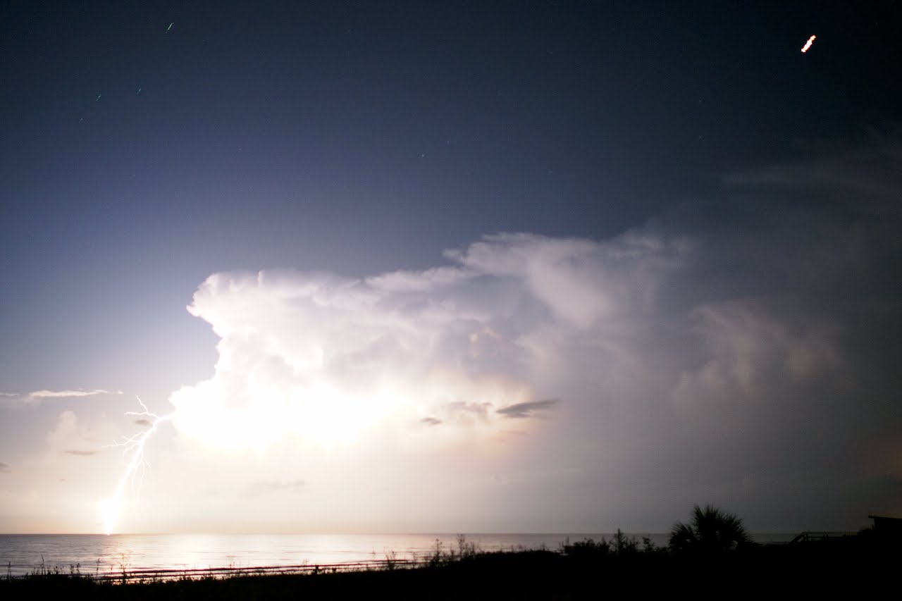

August 2018. We were meant to go to Fort Meyers, but the red tide thwarted us. Disgusting red algae in the water killing boat loads of fish all over the beaches! Fast re-planning ended us up in St. Augustine which ended up OK as St. Augustine and the beaches there are great.




